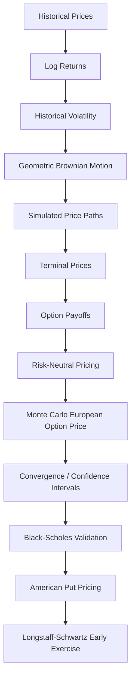
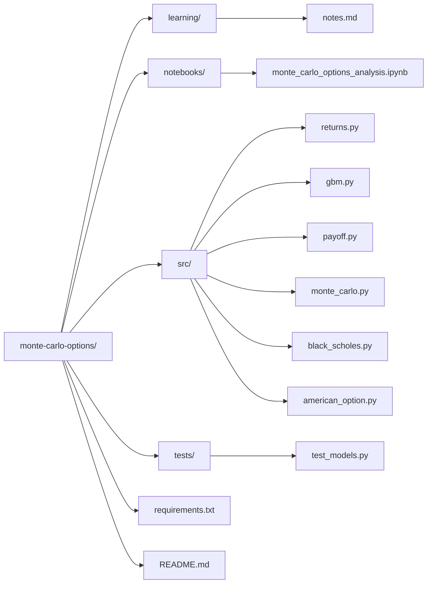
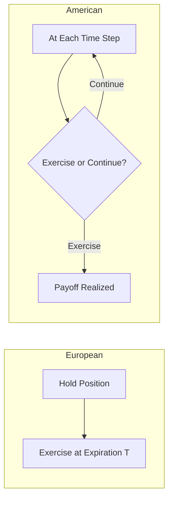
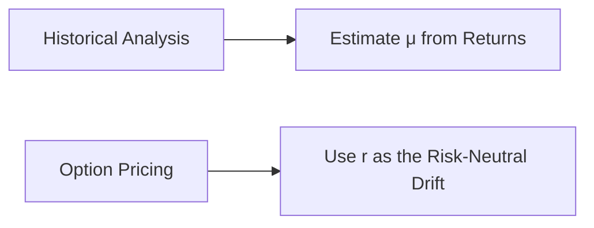

# Monte Carlo Options Pricing

**A quantitative finance project implementing Monte Carlo methods for option pricing** — built incrementally from historical returns and volatility, through Geometric Brownian Motion and European option pricing, to convergence analysis and American option pricing via Longstaff–Schwartz.


---

## Table of Contents

- [Overview](#overview)
- [Pipeline](#pipeline)
- [Project Structure](#project-structure)
- [Module Reference](#module-reference)
- [Getting Started](#getting-started)
- [Usage](#usage)
- [Testing](#testing)
- [Mathematical Foundations](#mathematical-foundations)
- [European vs. American Options](#european-vs-american-options)
- [Validation](#validation)
- [Visual Analysis](#visual-analysis)
- [Modeling Notes](#modeling-notes)

---

## Overview

This project builds a Monte Carlo options pricing framework from first principles, covering historical volatility estimation, Geometric Brownian Motion, European option pricing, convergence analysis, Black-Scholes validation, and American option pricing using Longstaff-Schwartz Monte Carlo.

## Pipeline



## Project Structure



See [Module Reference](#module-reference) below for what each file does.

## Module Reference

| Module | Purpose |
|---|---|
| `src/returns.py` | Calculates log returns, mean return, variance, standard deviation, and annualized volatility |
| `src/gbm.py` | Generates stock-price paths using Geometric Brownian Motion |
| `src/payoff.py` | Calculates call and put payoffs at expiration |
| `src/monte_carlo.py` | Prices European options using risk-neutral Monte Carlo |
| `src/black_scholes.py` | Provides analytical European option prices for validation |
| `src/american_option.py` | Prices an American put using Longstaff-Schwartz Monte Carlo |
| `notebooks/monte_carlo_options_analysis.ipynb` | Visual analysis, plots, convergence, and model comparison |
| `learning/notes.md` | Detailed mathematical learning notes |

## Getting Started

**Clone and set up a virtual environment:**

```bash
python3 -m venv venv
source venv/bin/activate
```

**Install dependencies:**

```bash
pip install -r requirements.txt
```

## Usage

Run individual modules directly:

```bash
python3 src/returns.py
python3 src/gbm.py
python3 src/payoff.py
python3 src/monte_carlo.py
python3 src/black_scholes.py
python3 src/american_option.py
```

Run the test suite:

```bash
pytest
```

Launch the analysis notebook:

```bash
jupyter notebook
```

Then open `notebooks/monte_carlo_options_analysis.ipynb`.

## Testing

The project includes unit tests covering:

- Option payoff calculations
- GBM path generation
- Black-Scholes pricing
- Monte Carlo pricing and convergence
- American option pricing

Run:

```bash
pytest
```

## Mathematical Foundations

*(Full derivations, including log returns, sample variance, and annualized volatility, are in [`learning/notes.md`](learning/notes.md).)*

**Geometric Brownian Motion**

General simulation:

$$S_{t+dt} = S_t \exp\left[\left(\mu - \frac{1}{2}\sigma^2\right)dt + \sigma\sqrt{dt}\,Z\right]$$

For option pricing, drift is replaced by the risk-free rate $r$:

$$S_{t+dt} = S_t \exp\left[\left(r - \frac{1}{2}\sigma^2\right)dt + \sigma\sqrt{dt}\,Z\right]$$

where $Z \sim N(0,1)$.

**Option Payoffs**

$$C_T = \max(S_T - K, 0) \qquad P_T = \max(K - S_T, 0)$$

**Monte Carlo Price**

$$V_0 \approx e^{-rT} \frac{1}{N}\sum_{i=1}^{N} \text{Payoff}^{(i)}$$

**Standard Error & 95% Confidence Interval**

$$SE = e^{-rT}\frac{s_{\text{payoff}}}{\sqrt{N}} \qquad V_0 \pm 1.96\,SE$$

## European vs. American Options

| | European | American |
|---|---|---|
| Exercise timing | Only at expiration | Any time up to expiration |
| Pricing input | Terminal price $S_T$ | Full path, multiple exercise dates |
| Method used | Risk-neutral Monte Carlo | Longstaff-Schwartz Least-Squares Monte Carlo |



The European option is implemented first, as it provides the foundation for the more complex American-option problem.

## Validation

The European Monte Carlo price is validated against the analytical Black-Scholes price. Exact agreement isn't the goal — Monte Carlo carries inherent sampling error — but the estimate should converge toward the analytical value as the number of simulations increases.

## Visual Analysis

The notebook includes:

- Simulated GBM price paths
- Terminal stock-price distribution
- Call payoff distribution
- Call payoff as a function of terminal stock price
- Monte Carlo convergence
- Monte Carlo confidence intervals
- Monte Carlo vs. Black-Scholes comparison
- Volatility sensitivity
- American put comparison

## Modeling Notes

The historical expected return estimated in `returns.py` reflects real-world drift and is useful for understanding historical behavior. However, under the risk-neutral Monte Carlo framework used for pricing, drift is replaced by the risk-free rate:



This distinction — between the real-world measure and the risk-neutral measure — is fundamental to the project and to derivative pricing in general.