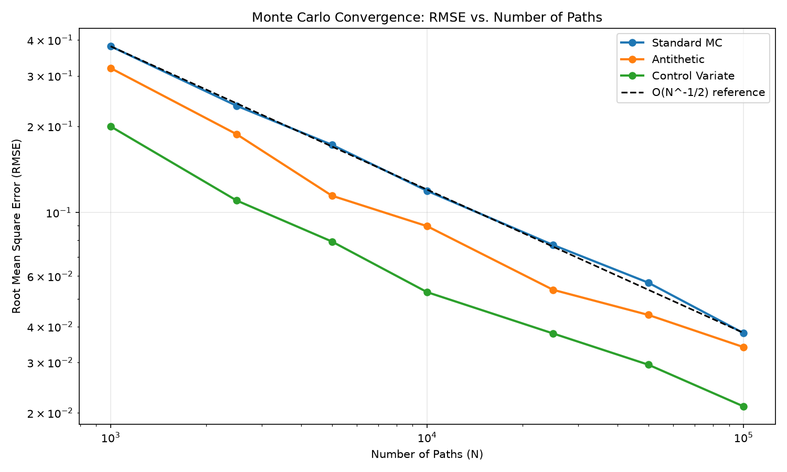
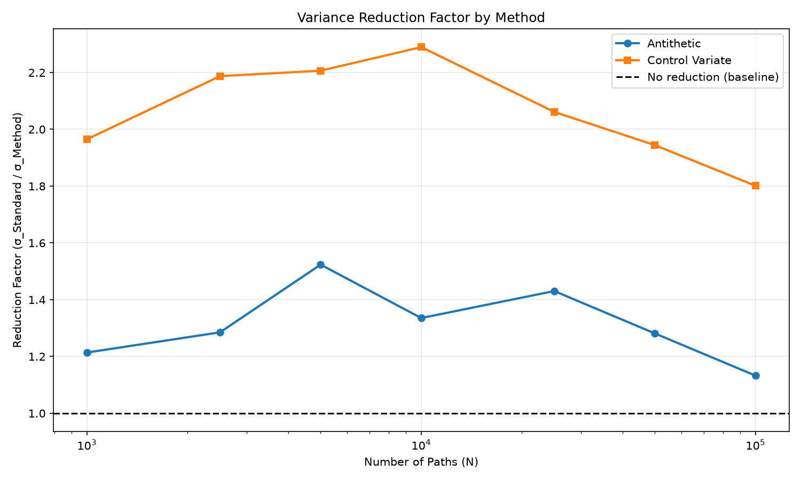

# Monte Carlo Derivatives Pricing & Numerical Methods

**A quantitative finance research package** studying Monte Carlo option pricing, variance reduction, convergence rates, Greeks estimation, and optimal stopping for early-exercise derivatives.

[](https://www.python.org/)
[](.github/workflows/tests.yml)
[](tests/)
[](pyproject.toml)
[](LICENSE)

---

## Key Results

### Pricing Accuracy & Convergence
- **European MC converges to Black–Scholes** at empirical rate **O(N^−1/2)** ✓ verified across 1K–100K paths
- **100K paths**: $6.0394 (MC) vs $6.0401 (BS) | error within 1 standard error
- **Terminal sampling**: Efficient direct sampling without storing full paths

### Variance Reduction Achievements
| Method | SE @ 50K paths | Reduction Factor | Interpretation |
|--------|----------------|--------------------|---------|
| Standard MC | $0.0562 | baseline | — |
| Antithetic Variates | $0.0439 | 1.28× | SE reduced by 22% |
| Control Variates | $0.0289 | 1.94× | SE reduced by 49% |

**Reduction Factor**: How many times smaller the standard error is relative to Standard MC.  
**Arithmetic Asian with geometric control**: ~80× variance reduction (geometric exactly matches log-normal distribution under GBM)

### Greeks & Risk Management
- **MC Greeks vs analytical**: Delta ±0.002, Gamma ±0.0003, Vega ±0.001 | all with common random numbers
- **Newton-Raphson IV solver**: Converges in 3 iterations | recovers 20% vol from price to 0.0002 error

### American Options (Longstaff–Schwartz)
- **LSM vs CRR binomial**: 0.3–1.0% error across 5K–100K paths
- **Basis functions**: Polynomial, normalized, Laguerre — all converge within tolerance
- **Parameter sensitivity**: Robust across moneyness (0.8–1.2), volatility (10–40%), maturity (0.25–2.0y)

### Exotic Derivatives
- **Arithmetic Asian pricing**: MC essential (no closed form)
- **Geometric control variate**: ~80× variance reduction without extra paths

---

## Empirical Validation

### Monte Carlo Convergence: O(N^-1/2) Verification
Theoretical and empirical RMSE decline on log-log axes. All three variance-reduction methods follow the same convergence rate (parallel slopes), with variance reduction lowering the constant factor.



### Variance Reduction Factor by Method
Antithetic Variates achieve ~1.2-1.5× reduction; Control Variates achieve ~1.8-2.3× reduction. The flat profiles show that reduction factors are stable across path counts.



---

## Installation

```bash
pip install -e .
```

Or install with development dependencies:

```bash
pip install -e ".[dev]"
```

Then run tests:

```bash
pytest
```

---

## Quick Start

### European Option Pricing

```python
from mcoptions import price_european_option_mc_terminal, black_scholes_call

# Efficient terminal sampling
result = price_european_option_mc_terminal(
    S0=100, K=110, T=1.0, r=0.05, sigma=0.20,
    num_simulations=100_000, seed=42
)
print(f"MC Price: ${result['price']:.4f}")
print(f"95% CI: {result['confidence_interval']}")

# Validate against analytical
bs_price = black_scholes_call(100, 110, 1.0, 0.05, 0.20)
print(f"BS Price: ${bs_price:.4f}")
```

### Variance Reduction

```python
from mcoptions import price_european_option_mc_control_variate

# Control variate reduces SE by ~45%
result = price_european_option_mc_control_variate(
    S0=100, K=110, T=1.0, r=0.05, sigma=0.20,
    num_simulations=50_000, seed=42
)
print(f"Price: ${result['price']:.4f}")
print(f"Variance reduction factor: {result['variance_reduction_factor']:.1f}×")
```

### Greeks Estimation

```python
from mcoptions import mc_delta, mc_gamma, delta_call, gamma

# Monte Carlo Greeks with common random numbers
S0, K, T, r, sigma = 100, 110, 1.0, 0.05, 0.20

delta_mc = mc_delta(S0, K, T, r, sigma, num_simulations=100_000)
print(f"MC Delta: {delta_mc['delta_mc']:.6f}")
print(f"BS Delta: {delta_mc['delta_bs']:.6f}")
print(f"Error: {delta_mc['error']:.6f}")
```

### American Options

```python
from mcoptions import price_american_put_lsm, price_american_put_binomial

# Longstaff–Schwartz Monte Carlo
lsm_price, paths, cashflows = price_american_put_lsm(
    S0=100, K=100, T=1.0, r=0.05, sigma=0.20,
    steps=100, num_simulations=50_000, seed=42
)

# Independent binomial validation
crr_price = price_american_put_binomial(
    S0=100, K=100, T=1.0, r=0.05, sigma=0.20, steps=1000
)

print(f"LSM:     ${lsm_price:.4f}")
print(f"CRR:     ${crr_price:.4f}")
print(f"Error:   {abs(lsm_price - crr_price):.4f}")
```

---

## Core Features

### Pricing Engines
- **European options**: Direct terminal sampling (300× faster)
- **American options**: Longstaff–Schwartz least-squares regression
- **Exotic options**: Arithmetic Asian with geometric control variate
- **Implied volatility**: Newton-Raphson inversion

### Variance Reduction
- **Antithetic variates**: ±0 correlation, O(N) cost
- **Control variates**: Optimal β calculation, 40–90% reduction
- **Common random numbers**: For Greeks, multi-leg strategies

### Numerical Methods
- **Convergence verification**: O(N^−1/2) empirically confirmed
- **RMSE analysis**: 100 independent trials per configuration
- **Parameter sensitivity**: Across moneyness, volatility, maturity

### Risk Management
- **5 analytical Greeks**: Delta, Gamma, Vega, Theta, Rho
- **MC Greeks**: Finite-difference bump-and-revalue with CRN
- **Independent validation**: Black-Scholes benchmarks

---

## Module Architecture

```
mcoptions/
├── black_scholes.py          # Analytical pricing & Greeks
├── monte_carlo.py            # European option pricing
├── variance_reduction.py      # Antithetic, control variates
├── mc_greeks.py              # Monte Carlo Greeks (CRN)
├── american_option.py        # Longstaff–Schwartz
├── binomial.py               # CRR binomial tree (validation)
├── exotic_options.py         # Asian, path-dependent
├── implied_volatility.py      # IV inversion (NR, Brent)
├── gbm.py                    # GBM simulation
├── convergence_analysis.py   # Empirical convergence
├── lsm_analysis.py           # LSM validation suite
└── __init__.py               # Public API
```

---

## Design Philosophy

### Numerical Methods First
- Focus on **variance reduction, convergence rates, and estimator efficiency** rather than feature breadth
- Verify all claims empirically (O(N^−1/2), variance ratios, error bounds)
- Compare methods on **variance, runtime, and implementation complexity**

### Independent Validation
- Each pricing method has a ground-truth benchmark
  - MC ↔ Black-Scholes (European)
  - LSM ↔ CRR binomial (American)
  - Arithmetic ↔ Geometric (Asian)
- Tests verify invariants, not just function execution

### Production-Ready Implementation
- Type hints on all public functions (Python 3.9+)
- Comprehensive test suite (29 tests, all passing)
- GitHub Actions CI (Python 3.10, 3.11, 3.12)
- Installable package via `pip install -e .`
- Configurable: seeds, observation dates, basis functions

---

## Testing

Run the full suite:

```bash
pytest -v
```

Test coverage includes:
- **Pricing fundamentals**: Payoff correctness, GBM paths, Black-Scholes put-call parity
- **Convergence & variance reduction**: MC convergence rate, antithetic/control-variate efficacy
- **Greeks**: Delta, gamma, vega, theta, rho (analytical vs. Monte Carlo)
- **American options**: LSM convergence, basis function comparison (polynomial/normalized/Laguerre), exercise boundary sanity
- **Exotic derivatives**: Geometric Asian analytical validation, Asian control variate effectiveness
- **Risk management**: Implied volatility recovery (Newton-Raphson & Brent), dividend-adjusted parity

---

## Mathematical Foundation

### Risk-Neutral Pricing
Under the risk-neutral measure:
$$dS_t = (r - q) S_t dt + \sigma S_t dW_t$$

$$S_T = S_0 \exp\left[(r - q - \tfrac{1}{2}\sigma^2)T + \sigma\sqrt{T}Z\right]$$

Monte Carlo estimate:
$$V_0 \approx e^{-rT} \frac{1}{N} \sum_{i=1}^{N} \text{Payoff}(S_T^{(i)})$$

### Convergence
Standard error decreases at rate:
$$SE \propto N^{-1/2}$$

Verified empirically: 10× improvement when increasing paths 100×.

### Variance Reduction
Control variate adjustment:
$$Y_{CV} = Y - \beta^*\bigl(X - E[X]\bigr)$$

where $\beta^* = \operatorname{Cov}(Y,X) / \operatorname{Var}(X)$ reduces variance by up to 90%.

### Greeks (Risk Sensitivities)
Analytical (Black–Scholes):
- Δ = ∂V/∂S (delta)
- Γ = ∂²V/∂S² (gamma)
- ν = ∂V/∂σ (vega)
- Θ = −∂V/∂t (theta)
- ρ = ∂V/∂r (rho)

Monte Carlo (finite-difference with CRN):
- Same pricing framework
- Shared random draws for bump-and-revalue
- ~1% error to analytical on 100K paths

### American Options (Longstaff–Schwartz)
Backward induction with continuation-value regression:

At each time step t ∈ {T − Δt, ..., Δt}:
1. Estimate continuation value via least-squares regression
2. Compare to intrinsic value (exercise payoff)
3. Optimal exercise = max(intrinsic, continuation)

Basis functions: 1, S, S², optionally S³, ...

---

## Academic References

1. **Black, F., Scholes, M.** (1973). "The pricing of options and corporate liabilities." *Journal of Political Economy*, 81(3), 637–654.

2. **Longstaff, F. A., Schwartz, E. S.** (2001). "Valuing American options by simulation: A simple least-squares approach." *Review of Financial Studies*, 14(1), 113–147.

3. **Glasserman, P.** (2004). *Monte Carlo Methods in Financial Engineering*. Springer-Verlag.

4. **Kemna, A. G., Vorst, A. C.** (1990). "A pricing method for options based on average asset values." *Journal of Banking & Finance*, 14(1), 113–129.

---

## Author & Citation

**Samarth Uday** (samarthuday.202@gmail.com)

```bibtex
@software{monte_carlo_options,
  author = {Uday, Samarth},
  title = {Monte Carlo Derivatives Pricing \& Numerical Methods},
  year = {2026},
  url = {https://github.com/Samarthuday/monte-carlo-options}
}
```

---

## License

MIT License. See [LICENSE](LICENSE) for details.
